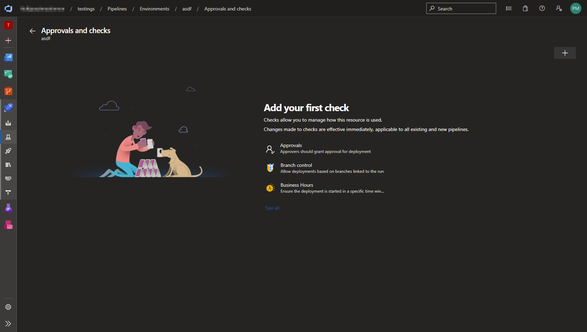
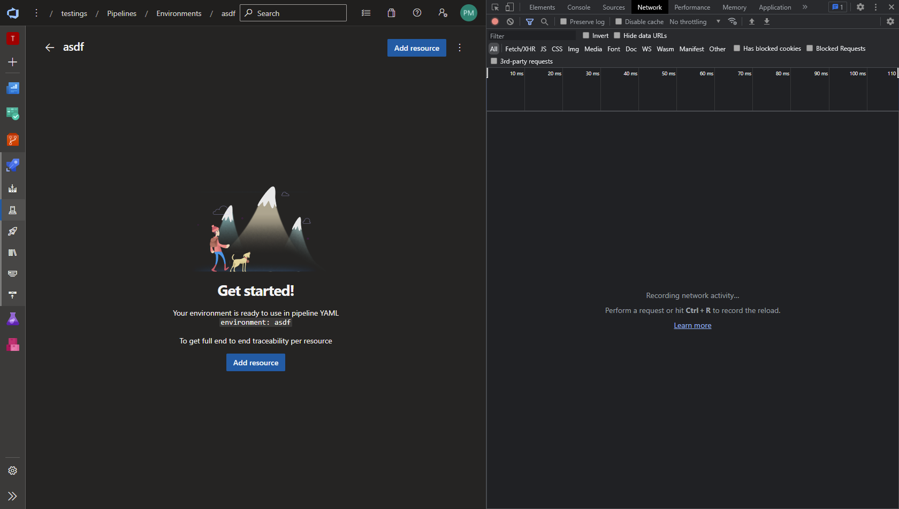
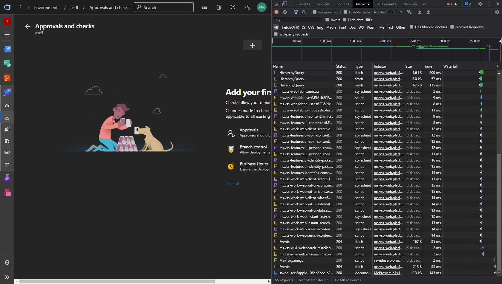
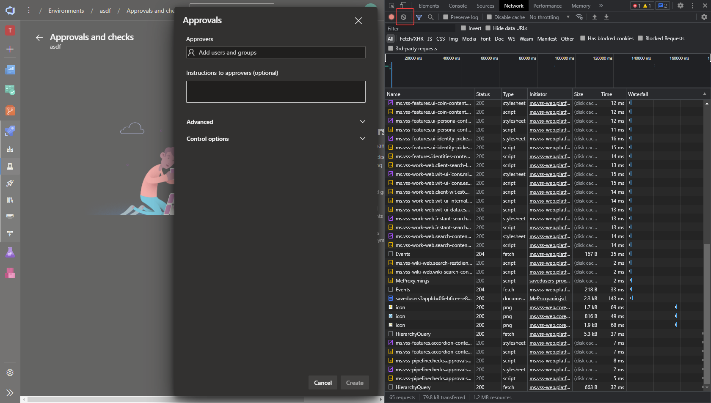
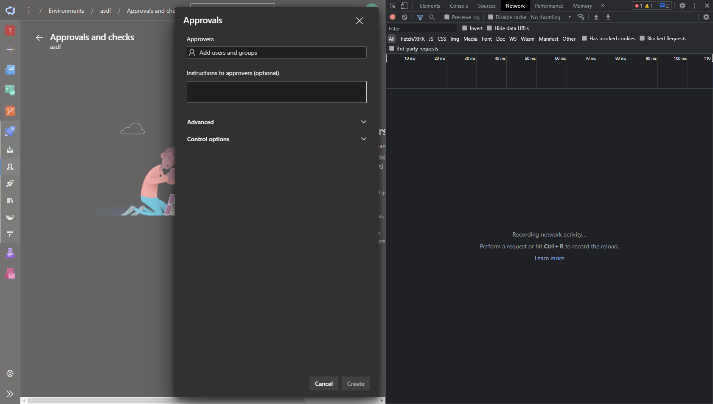
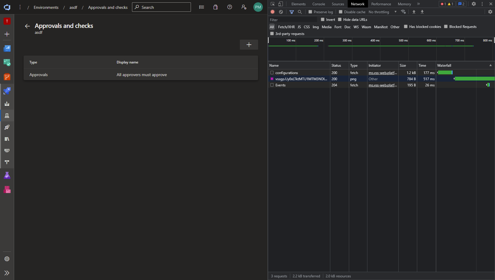
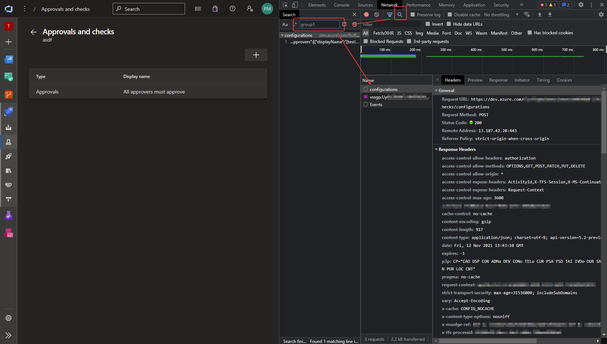
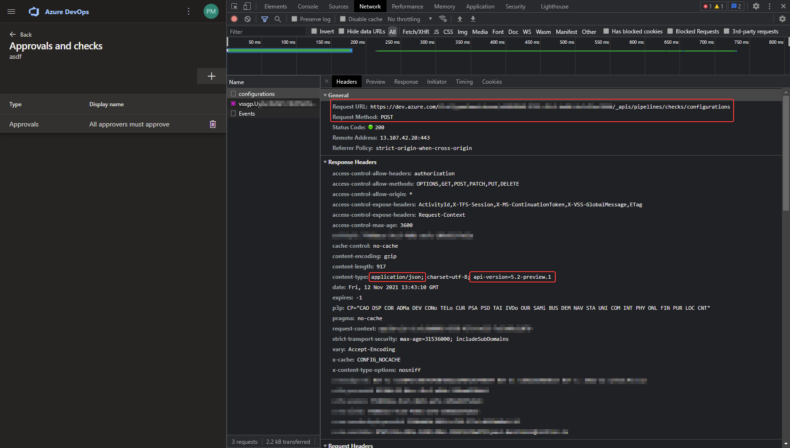
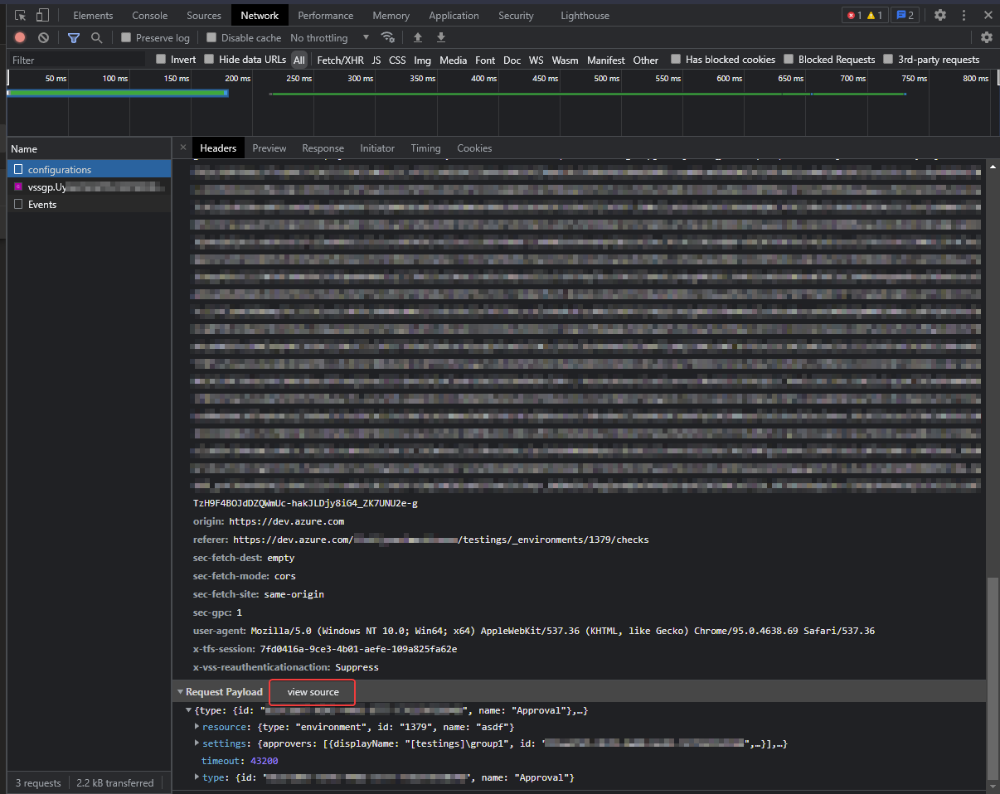

# Accessing Undocumented Azure DevOps APIs


👉 https://docs.microsoft.com/en-us/rest/api/azure/devops
Azure DevOps has some pretty useful APIs, but it doesn't have everything I want. For quite some time I found it frustrating that some of the stuff I wanted to do could only be done via portal clicky clicks, and for an "automationist", that's not cool. I did some web searching to see if there were any better ways, and eventually stumbled across a page that with a guide on getting undocumented APIs, although unfortunately I cannot find it any more.

Even though it showed me how to find these APIs it didn't show me all which was possible. I have to thank a colleague for setting me on this path, and thus I have more added tricks which can help you out even more, so read on...


### Theoretical Use Case

For this example I'm going to use the idea that I want to **"programmatically add a user/group approval check to a Azure DevOps Environment"** (or a bunch of them), where no API in the documents exist.


### Let's Get Straight To It

👉 https://docs.microsoft.com/en-us/rest/api/azure/devops/distributedtask/environments?view=azure-devops-rest-6.1

As you can see from this link above, we only have the option to do basic Environmental changes. Very basic. For this demo I have already created an Environment called, imaginatively `asdf`.



What we want to do is immediately get into **Developer Mode** by pressing `F12` on Google Chrome (or whatever button your browser requires of you) to bring up the console, and click on `Network` at the top.



At the moment nothing will show, as we haven't reloaded the page or done anything, but once we do, you'll see this populate with loads of stuff. Since our main focus is adding an approval check, so click the drop down menu next to `Add Resource` on the AzDO page and select `Approvals and checks`. When the page loads you'll see a boat load of network activity on the right.



There's a lot of stuff here, but don't worry, we'll clear it later when we get to the part that interests us the most. Click the `+` icon and then select `Approvals` and click `Next`. Now, this is where we want to be, and we want to have a clean slate of information so it makes it easier for us to locate what we want. So on this page, click the **clear** icon in the console to wipe our slate clear.



So it looks like this:



Now, add your user or group, and any other options that you may want to enable/disable. If the Network console gets filled up with any more information, just clear it again before you proceed. Only once you have the form filled out how you want it, click `Create`.



You should have something like the above, where there's only a minute amount of activity processed. On my page I can see that `configurations` with type of `fetch` would be interesting to look at. If you have a few, or are not sure what you should be looking for, it's a good idea to use the Search feature of debugging, and search for the name of the user or group that you just added. In my case, it was `group1`.



This is where it gets interesting, as there's a few things you want to look at here.

- Request URL: is URL of the API we're hitting
- Request Method: is the type of method (GET, PATCH, POST...)
- content-type: where we are going to grab the API version of the URL and the type of payload we are sending

These are the 3 main things which we need for our API call. If you're only doing  a `GET` call, then this is probably all you need. However, as you can see we are doing a POST, which means it's expecting some data.



If you scroll further down you'll find the `Request Payload` in pretty print; just click the `view source` option and you'll see the full JSON payload as it should be. Copy that out and bring into your code editor.



I won't show you what my output was, but I will show you what I narrowed down to what the Payload needed to be. There's a lot of junk in there, and not all of it is needed. I did a basic trial and error of removing some content and sending it to AzDO to see what's the minimum amount of data I needed via Postman (https://www.postman.com/).

```json
{
    "type": {
        "name": "Approval"
    },
    "settings": {
        "approvers": [
            {
                "displayName": "",
                "id": "",
                "descriptor": "",
                "imageUrl": ""
            }
        ],
        "minRequiredApprovers": 0,
        "requesterCannotBeApprover": false
    },
    "resource": {
        "type": "environment",
        "id": "",
        "name": ""
    },
    "timeout": 30
}
```

My preferred way of automating stuff lately is via PowerShell. Here's a snippet of how I used that code to perform my task.

I'll mention here that the web page is using your current logged on credentials. When you get to creating your API call you will need to generate a Personal Access Token with the correct privileges that can do the stuff you want. Obviously if you have NFI, just give it God mode and narrow it down as you do your testing.

```powershell
$base64token = [Convert]::ToBase64String([Text.Encoding]::UTF8.GetBytes(":$Token"))
$headers     = New-Object "System.Collections.Generic.Dictionary[[String],[String]]"
$headers.Add("Authorization", "Basic $base64token")
$headers.Add("Content-Type", "application/json")

if($approversIncorrect) {
    [array]$groupsArray = @()
    $Global:groups[$Type][$Env].Keys | Select-String -Pattern "Admins" | Foreach-Object {
        $obj              = [PSCustomObject]@{
            "displayName" = "[$Global:project]\$($_)"
            "descriptor"  = $Global:groups[$Type][$Env]["$_"].descriptor
            "id"          = $Global:groups[$Type][$Env]["$_"].id
            "imageUrl"    = "/${Global:organization}/_apis/GraphProfile/MemberAvatars/$($Global:groups[$Type][$Env]["$_"].descriptor)"
        }
        $groupsArray += $obj
    }

    $body = '{
        "type": {
            "name": "Approval"
        },
        "settings": {
            "minRequiredApprovers": 1,
            "requesterCannotBeApprover": true
        },
        "resource": {
            "type": "environment",
            "id": "",
            "name": ""
        },
        "timeout": 30
    }' | ConvertFrom-Json

    $body.resource.id   = $EnvId
    $body.resource.name = $EnvName
    $body.settings | Add-Member -NotePropertyName "approvers" -NotePropertyValue $groupsArray

    Write-Host "[+] ADDING: Approval groups" -ForegroundColor "Green"
    $url = "https://dev.azure.com/${Global:organization}/${Global:projectId}/_apis/pipelines/checks/configurations?api-version=5.2-preview.1"
    Invoke-RestMethod -Uri $url -Method 'POST' -Headers $headers -SkipCertificateCheck -Body $($body | ConvertTo-Json -Depth 10) | Out-Null

```

To give you a "big picture" example of how I've used this on a client site, check out my full PowerShell script where I `Dynamically creates Azure DevOps "Environments" with security permissions, approvers and branch control`.

Hope this was of use to some people, as I have found it immensely useful in advancing my automation through Azure DevOps (and other things!) where automation never fully existed.

Obviously there comes a caveat to this that; _the APIs might work today, but will they work tomorrow?_ That I cannot answer, as this is undocumented stuff. However I can say that I have been successfully using this without any issues or modifications of code for the last 4 months. Not bad, eh? As long as you know where to look, you can easily update your code as it changes.